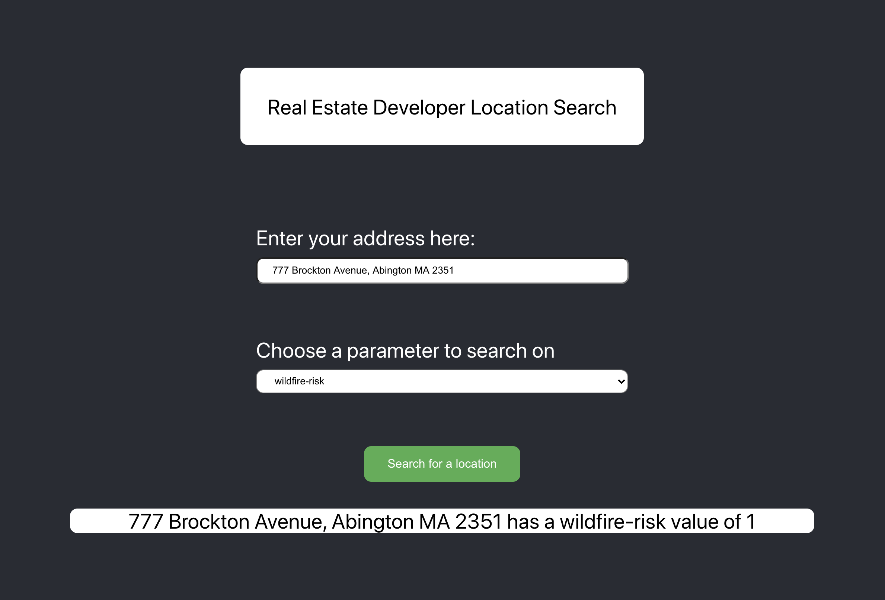

# Overview

This is a small project for the Iggy Take home designed to help real estate developers or architects figure out and imagine what a location looks like given
a specific address. It has two main goals:

1. Allowing users to query based on address instead of latitude and longitude
2. Allows users to search for specific paramters

One future goal for this is to implement bulk uploading and allow users to see their locations sorted/filtered on a specific paramter to optimize decisions

## Additional Libraries used

This project was bootstrapped out of create-react-app. It does not use any additional libraries.

In terms of API's, the project uses

## Instructions to get started

1. Clone the repository using your favorite cloning method (ssh, HTTPS)
2. run `yarn install (-i)` to install all libraries.
3. run `yarn start` to get the project up and running!

## Everything below comes from default and is left as a helpful reminder

## Available Scripts

### `yarn start`

Runs the app in the development mode.\
Open [http://localhost:3000](http://localhost:3000) to view it in the browser.

The page will reload if you make edits.\

### `yarn test`

Launches the test runner in the interactive watch mode.\
See the section about [running tests](https://facebook.github.io/create-react-app/docs/running-tests) for more information.

### `yarn build`

Builds the app for production to the `build` folder.\
It correctly bundles React in production mode and optimizes the build for the best performance.

The build is minified and the filenames include the hashes.\
Your app is ready to be deployed!

### `yarn eject`

**Note: this is a one-way operation. Once you `eject`, you can’t go back!**

If you aren’t satisfied with the build tool and configuration choices, you can `eject` at any time. This command will remove the single build dependency from your project.
